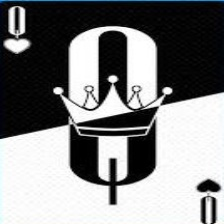
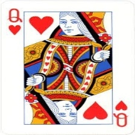

# Card Identification

## Introduction
Project created as the Capstone Project 1 for the online bootcamp: Machine Learning Zoomcamp ([link](https://github.com/alexeygrigorev/mlbookcamp-code)).

### Objective

The project's objective is to identify the rank and suit of a standart 52 card deck from normal or customized decks, using 
deep learning models and techniques.

<hr>

## Data

Dataset can be found in dataset folder, or by downloading from [here](https://www.kaggle.com/datasets/gpiosenka/cards-image-datasetclassification).

This dataset contains 7624 training images, 265 test images and 265 validation images. Already divided in the train, test and validation directories, which are partitioned into 53 sub directories, one for each of the 53 types of cards. All images are 224 X 224 X 3 in jpg format and have been cropped so that only the image of a single card is present and the card occupies well over 50% of the pixels in the image.(Font: kaggle)

Samples images from dataset:

- queen of hearts

<br>





<hr>

## How to run

It's recommedend to use a virtual environment. For example:

1. Intall virtualenv:
```
pip install virtualenv
```
2. Create a virtualenv(ubuntu):
```
python3 -m venv <env_name>
```
3. Activate the environment(ubuntu):
```
source <env_name>/bin/activate
```
4. Install all modules/dependencies:
```
pip install -r requirements.txt
```
5. Build the application docker:
```
docker build -t <docker_img_name> .
```
6. Run the application docker:
```
docker run -it -p 9696:9696 <docker_img_name>:latest
```

Now the application is running and is ready to receive request for predictions.

BONUS:

1. Run prediction tests
```
python predict_test.py
```
2. For more tests, change the path from card_data with the path of other cards from [test dataset](datasets/test/).

Example:
```
img_test_path = 'dataset\\test\\jack of clubs\\5.jpg'
```

<hr>

## Project

This project includes:

- Data Preparation / Cleaning
- EDA
- Train and validate models
- Choose best model
- Parameter tuning
- App with model trained for prediction
- Containerization

Deep learning models used:

- Xception
- VGG16
- ResNet50V2
- MobileNetV2

Best Classifier: <b>VGG16</b>

Parameters for tuning:

- learning rate
- inner size
- data augmentation

Best Model:
- Epochs: 10
- accuracy:  0.658

Prediction Example:


<hr>

## Future improvements

As you can see, the model had a <b>low accuracy (65.8%)</b> due to <b>little training (10 epochs)</b> caused by the imminent project deadline. Training with more epochs could lead to a model with better accuracy and easier decision between which models and parameters improved the accuracy. 
